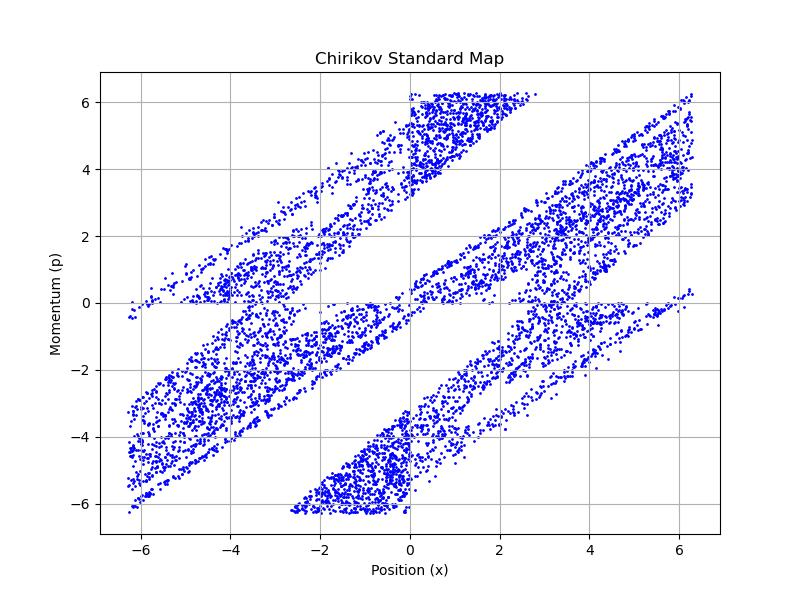

# Chirikov_Standard_Map-
Chirikov standard map by FORTRAN90

The Chirikov standard map is a simple, yet fundamental, example of a chaotic dynamical system, defined by the following equations:
pn+1=pn+Ksin⁡(xn) mod (2π)
pn+1​=pn​+Ksin(xn​)mod(2π)
xn+1=xn+pn+1 mod (2π)
xn+1​=xn​+pn+1​mod(2π)

where:

    p represents the momentum.
    x represents the position.
    K is a parameter that determines the degree of chaos in the system.

Step 1: Write the Fortran Code

Here is a Fortran program that computes the iterations of the Chirikov standard map for arbitrary initial values of pp, xx, and KK:
