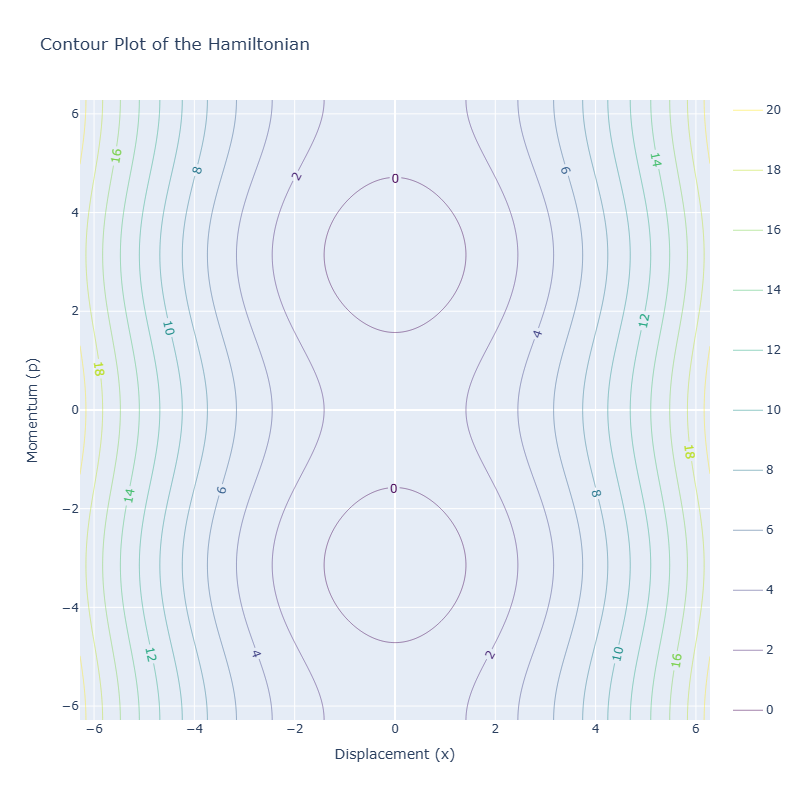

# Chirikov standard map by FORTRAN90

**The Chirikov Standard Map: A Simple Chaotic System**

The Chirikov standard map is a fundamental example of a chaotic dynamical system. In its simplicity, it exhibits a rich tapestry of behaviors, making it a valuable tool for understanding chaos and its implications in various fields.

**Equations**

The map is defined by the following pair of equations:

$$p_{n+1} = p_n + K \sin(x_n) \pmod{2\pi}$$

$$x_{n+1} = x_n + p_{n+1} \pmod{2\pi}$$

where:

- **p** represents the momentum of the system at a given time step (n).
- **x** represents the position of the system at a given time step (n).
- **K** is a parameter that controls the degree of chaos in the system. As K increases, the system's behavior becomes increasingly chaotic.

**Interpretation**

- The first equation updates the momentum based on the current value of x and the parameter K. The sine function introduces a nonlinearity that is crucial for generating chaotic behavior.
- The second equation updates the position based on the updated momentum $$(p_{(n+1)})$$ from the previous step. The modulo operator (mod) ensures that both position and momentum values remain within the range of 0 to 2π.

By iterating these equations, the system evolves through a sequence of states, revealing various dynamical regimes depending on the chosen value of K. This iterative process allows us to explore how even a simple system can exhibit complex and unpredictable behavior.

---
# **Reference**

http://www.scholarpedia.org/article/Chirikov_standard_map?fbclid=IwY2xjawFWmo1leHRuA2FlbQIxMAABHZ5Zw2ZuUhkvemRi7YNwNibHqegtCg9lW2JUPONmNHpjSihTyYykOXCWNw_aem_0HsGwBRmYRbvLDZVIHUC6Q
